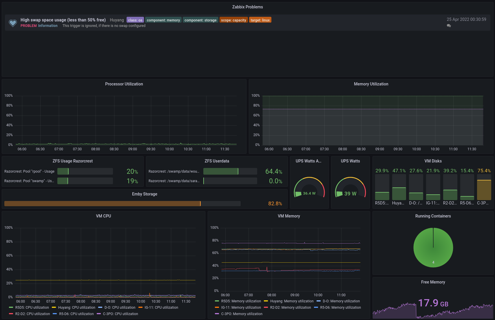
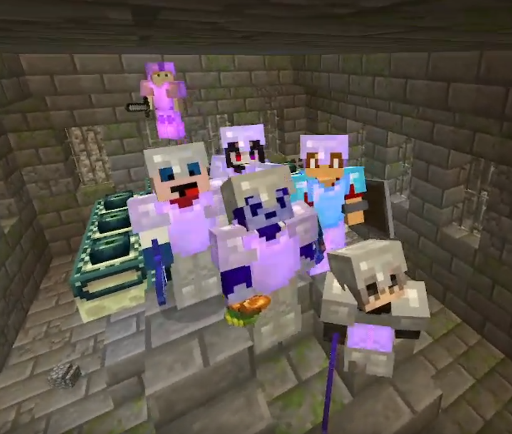
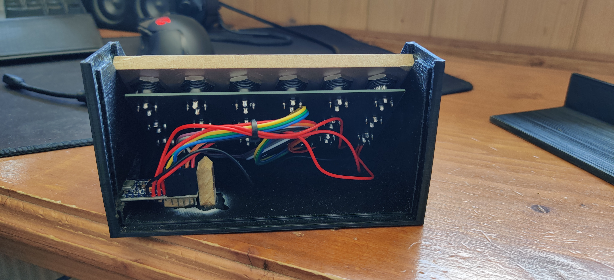
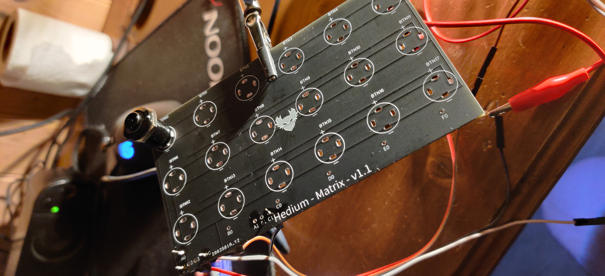
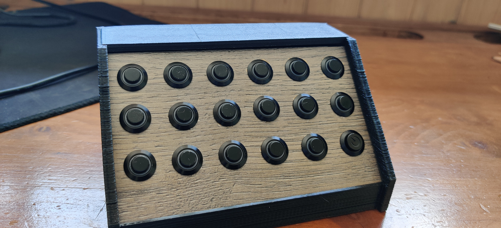
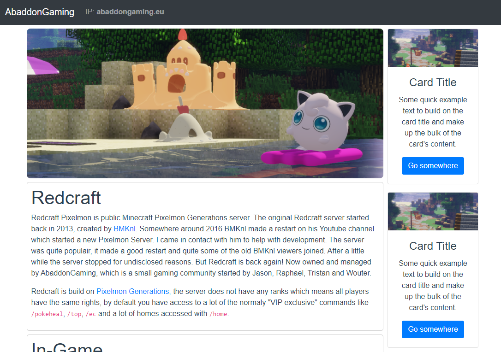
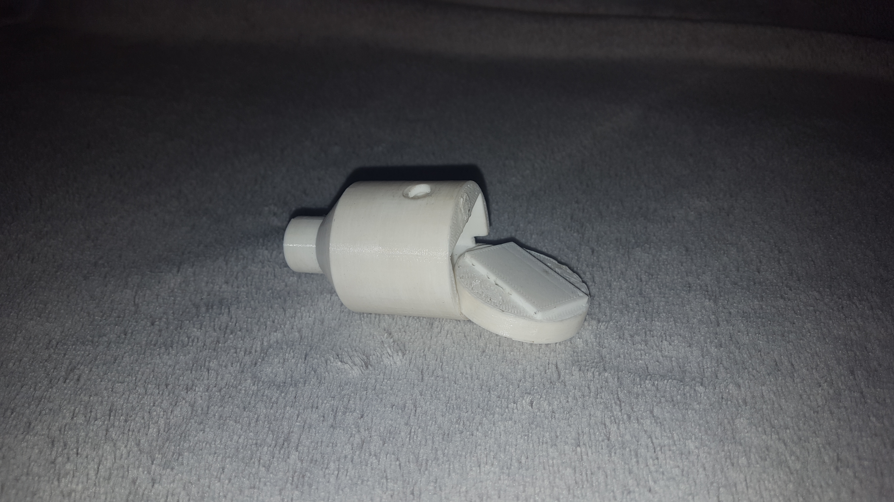

# Legacy website posts

This is an archive of my older project posts, these posts weren't written in the
long format style I am using now. And they weren't written in markdown, but in
HTML. I have converted them to markdown and added them to this website.

## 2023-01-02 Internship Finished!

Last week, I finished my internship at Netco Technology with a grade of 8.5.
During this internship, I worked on a project related to my Network and System
Engineering bachelor's degree. I created a Python application that generates
boilerplate configurations for Fortinet firewalls using Django, Jinja2, and
Yapsy modules. The application has a web-based user interface, per-config global
environment variables, custom error checking, firmware management and advanced
value calculation capabilities. Its versatility comes from its plugin-based
configuration building, which makes it easy to add new or change functionality
in the future.

It was an amazing experience learning new skills and refining my workflows. I
would like to express my gratitude to Jeroen Bakker at The Hague University of
Applied Sciences for their support, and Raymond Kuiper at Netco Technology for
his excellent mentorship. Thank you to everyone at Netco for the opportunities
and experiences I had during my internship.

## 2022-10-25 New internship!

Hi! It has been a while. Here is an update!

The new server is running great! Energy prices are through the roof right now,
but the server has been performing quite well. The hypervisor used to run on
Debian 11 with a full ZFS filesystem. But I encountered some problems, the
realtek 2.5GB NIC that is provided by the Asrock motherboard wasn't working
correctly with the latest debian kernels. I encountered problems with the NIC
falling back to 100mbit/s speeds even with the non-free realtek drivers. I left
this alone for a little while. Eventuality I encountered some extreme slowness
on the system. All programs were blocked for more than 120 seconds, reported by
the kernel. I switches the OS for Ubuntu 22.04, which picked up the Realtek card
perfectly without issue. The root filesystem is no longer ZFS, but ZFS is still
used for the NAS portion of the system. This has been perfectly stable without
any issues.

As part of my network and system engineering study, I have started a new
internship at Netco Technology. I am in charge of a Fortigate configuration
automation project. This has been an awesome experience. I have learned a lot
about network automation, Python and Fortinet products and configurations. I
have been busy developing software which is capable of receiving user input and
creating a Fortigate configuration which support for multiple models. This is
written in Python using Jinja2 for configuration building and Django for the
user frontend. I haven’t done much with Python before, but it is going well.

## 2022-04-25 School & a low power home server

I created strong decline in posts and updates on this website. This wasn't
intentional, I have been busy with school and some bigger home projects. But I
have not documented anything on here. Even though I have some plans for this
website. I would like to make these project posts more extensive. Right now I
write one or two paragraphs with a couple of pictures. Which is fine for some
smaller updates. But bigger projects could benefit from a better website
interface which would make it possible to create a page for each project.

So, what have I been doing since the last post? - I have been working on school
classes and projects. I just completed a network project which required us to
create an business network between two sides using a IPSEC tunnel to connect the
sides together. To provide the needed functionality, redundancy and security we
implemented the following: VRRP, MSTP, OSPFv3, IPSEC, ACLs, zone based security,
DHCP, DNS, SSH, QoS, Stormcontrol, DHCP snooping and port-security. It was a
great project which has me wanting to learn more about enterprise level
networking and system management.

I have migrated all my home services to a new server. I build a new server with
the goal of lower power usage and great video encoding / decoding. Energy prices
are quite high right now, which makes investing in newer hardware more feasible
then running power hungry older hardware. My old server wasn't capable of fast
hardware video decoding which made my use software decoding. The software
encoding was barely fast enough for one 720p video stream. The new server has a
i5-12400, which has a great hardware video decoding. The iGPU is passed through
to the Emby VM. Now Emby can easily handle multiple 4K streams! All while
leaving enough CPU performance for other tasks and other VMs. My old server had
two 1TB disks in a software mirror, the new server has 4 4TB NAS disks in a ZFS
z-1 pool. Which makes for a nice place to store my files and backups of virtual
machines. The VM's are running on 2 1TB nvme SSD's also running in a z-1 pool. I
have added a UPS to make downtime minimal and to prevent any abrupt shutdowns.
This setup has been running for about 2 months and it has been working great!

## 2021-07-11 End of the year

Here I am! I just discovered that I only made 3 posts this whole year. You know
how I discovered that? Because the dates of almost all these articles were
wrong! I just found out that all the posts of the year 2021 had the year 2020 in
there. And some of 2020 even had 2002. Oh well, that is fixed now. I have been
having a lot of fun making a Minecraft plugin called
[Slurp](https://github.com/wouterdebruijn/slurp\). It adds a drinking game to
Minecraft. (I know, the perfect student project) Me and my friend
[Sjors](https://github.com/schotsl/) have been over developing it quite a bit.
Instead of making a local db file or even connecting to a MySQL database, which
are quite conventional ways of storing data in a Minecraft plugin. We made a
Deno REST backend which talks to a MySQL database. This makes it possible to
create a dashboard website to show the drinking stats on a TV or other screen
without using an extra port on the Minecraft server. Of course all parts of the
project are open-source. So if the user doesn't want us to store their drinking
data, they can host the backend themselves. We have tested it with some friends
and it seems to work quite well. I have found a couple of bugs to fix, so I will
work on that in the coming weeks.

We started a new project at school. We are going to develop a smart home system
using a raspberry pi, wemos modules and some online apis. The pi and wemos
modules are programmed in C++, which should be a lot of fun. If possible, I want
to add a modern style dashboard to it. I would like to write this is Vue3, but I
won't be working on this project alone. So I will have to discuss this with the
rest of the project group.

## 2021-07-29 Summertime!

Welcome back! Its has been a little while since a posted a new article /
project. I haven't been giving much attention to this website lately. But of
course, I have been doing other things. I finished the first year of my HBO
education. I finished with all 60 study points, which means I got my
propaedeutic! I am really happy about that because that was my main focus for
this school year. Now that I have a lot more free time, I have been working on a
new support website for the company I work at, Hanex Service. If I haven't
discussed this earlier, I work at Hanex Service as a part-time fullstack
developer. I mainly create solutions in the form of backends and websites, but I
also help out the other IT related projects. I actually started work there
repairing music equipment, but we needed a support portal and I took the
challenge. That portal has been live for about a year now, and it is time for a
v2. The new portal will use MySQL, Deno and Vue3. I have become quite
comfortable with this stack, but of course I am still learning new things every
time I work on a project. That's what makes it fun!

I have been working on a new design for this website, but I have been getting
better at basic website design working on the v2 portal, so I will probably
change some stuff.

## 2021-01-09 A new year!

Is a new year! And I just noticed this website design is almost a year old! Even
though I had the tought of updating it since 2019-08-02, It's still here. I was
working on a new website writen in Vue3, but it's not finished yet. And I
haven't worked on it in a little while. Covid is still a thing, not gonna say
more about it. My study at The Hague is going really well! I almost finished the
first semester. After that I get new courses focused around Network and System
Enginering :). On a side node, I updated my home server, I am now running Debian
10 in place of my old CentOS 7 system. The main reason for installing a new
system was that the disk where the system was running on was starting to give
sector errors. Now the system is running on a SSD. I made the root partions
quite small which made for more unused space that can be used for some of my LXC
containers. Also using LVM now, so I can easly switch stuff around if needed. It
has been running like this for a couple of weeks without any problems, and way
faster then before! :)

## 2020-07-09 Finished my MBO education & Website Repo

Yeeeh! I finished my education at Nova College in Haarlem. I already talked
about this in the \"Script repo & New button panel\" post. But I wanted to give
this small update. I also made a change to this website. Normally I just change
the content on the server and don't think about it anymore. But I wanted to have
a git repo for this website to I can go back in changes. This will be nice when
I migrate to Vue.JS. But I also added a Git action that automatically pulls the
latest master branch to my server. This makes it easy to put new content on
here. I am also working on numerous projects. Some of these are private, so
there won't be an article about those. But I also started to help a friend with
an awesome new project. He wants to create a website like Trello and build it
from scratch. I might have had some influence in choosing the stack, because he
is using a Typescript backend and a Vue.JS frontend. :)

## 2020-06-17 Script repo & New button panel

Welcome back! It's been been quite some time since I posted a new project
update, Time flies! I have a couple of things to share. First of, I'm (almost)
done with my current college degree. I finished everything in time with good
grades, so I am not expecting anything special. The school is still deciding if
there will be a ceremony (because of Covid-19). But I'm basicly done! My current
plan for next year following a new degree at The Hague University of Applied
sciences (Delft campus). But now, the title of this article. First of; I opened
a new repository on Github so I can store my homebuild scripts which I use to
make some administration tasks easier. There is not much in there now, but I did
at my new Wireguard client creation script. More will follow. Also I made a new
version of my button panel project, this time with a custom PCB! I am realy
happy with the outcome of the electronics. It works really well and is way more
reliable then the older version which is quite fragile inside. I might revisit
the case design. The back panel warped quite a lot, so the backpanel does not
fit as nice as I had hoped for. I might reprint it in a better orientation.

 

## 2020-04-20 Website updates

Hi! I just made a small update to the website. First of there is a new page,
it's hidden so have fun finding it. I also added a favicon. Should have done
this a long time ago, better late then never. I am still planning on making a
new website written in vue. But I don't really like designing websites, I find
it hard to make something which is good looking and unique. I can also remake
this design in vue, but it could use a nice refresh.

For now I have updated some of the information and of course added the favicon,
which is inspired by one of my favorite games,
[Break the Game](https://store.steampowered.com/app/739540/Break_the_Game/)

## 2020-03-26 Vue website & Bright Project

It has been a little while since I made a post on this website. But this does
not mean I have not been doing projects like usual, I just didn't post any ;).
It has almost been a year since the last commit on Scontrol, my Smartish home
system. It is still working and I have made some changes to the version I run at
home to control my lights. But the code is old and I wasn't that great at
javascript programming back then. I am planning on making a new version, with a
new name. Bright, this will be version 2 of my smarthome system and hopefully
this one will be a bit smarten then its predecessor. I am planning on making it
so that when I want to add new features later, it does not need a complete
rewrite. Johnny Five, the package I use to communicate with the Arduino has a
feature to wirelessly connect to a board over Wifi or Bluetooth. I tested this
and it seems to work great. Which is nice because I need to relocate some of the
relays I am using to turn lights on and off.

Then Vue, I have mode some significant progress learning and when I wanted to
make a website for the gaming group I am in I thougth \"Why not! Lets do it in
Vue!\", so have a day later I had [this](https://abaddongaming.eu/), at the
point of writing this article it is not done yet. There is still filler text in
the news cards, because there is no backend to get news from. But its getting
there.

## 2020-01-30 Small site update

You might have noticed that this site got an update about a month ago. I did not
make an article at the time however, I have made some changes to the site. We
now have darkmode! (and lightmode for some people who would like it. But it does
not have everything I want yet. At the moment, these articles are stored in a
JSON file, which works fine, but it's not ideal. I would like to be able to
store my articles in markdown, and parse that to html. That way all aricles can
be in their own file, and I would be able to choose where the images are, give
them a label, and use hyperlinks better. Also, the script that generates these
articles from JSON is quite old, and I would be able to make it better now. I
would probaly go for something that's generated ones on my server site, instead
of building every time the client connects.

## 2019-08-02 This Site

I know this site needs an update. I am not working on this yet but I have made
some plans and goals for my new site. Programming is not my main skill, but I
would like to improve this site so it's looks good and has features that I like.

## 2019-03-26 SControl

[A friend](https://wouterdebruijn.nl/sjors.html) of mine has some Philips Hue
lights. You can control these lights from their API. I do not have those lights,
but I do have a spare arduino and some relays. So I started a new project.
[SControl](https://github.com/ElectroGamez/SControl) A nodejs web api that
interfaces with my arduino to control my lights. This is the first time I made a
API so it's not clean yet. But I will keep working on it and make it better. The
API can be used by a lot of things for now I can control it with a local website
and a Discord bot.

## 2019-02-01 H-Shifter

As told above, I play simulation games, one of those games is
[Euro Truck Simulator](https://eurotrucksimulator2.com/) in the past I played
this with a Logitech F310 and other various gamepads. But when I bought my
[Logitech G29](https://tweakers.net/pricewatch/455112/logitech-g29-driving-force/specificaties/)
I needed something to simulate the eaton fuller shifter, that has two buttons on
the side that change low/high range and low/high gear. I started searching on
internet and found a company that makes exactly this, but there were some
problems. 1. It was quite expensive. 2. They did not ship to The Netherlands. So
I started to make my own. First I made a small not to ergonomic shifter that had
room for two switches. (IMG1) It worked fine for quite a while, but when I made
by Button Panel, I wanted an upgrade. A larger more ergonomic version that I can
put beside my chair. (IMG2)

You can find the STL
files[here](https://github.com/ElectroGamez/general/blob/master/eaton%20Fuller%20Top.stl)
and[here](https://github.com/ElectroGamez/general/blob/master/eaton%20Fuller%20bottom.stl)
The shifter in connected to my button panel by a simple connector.

 

## 2019-02-01 Button Panel

I have a Logitech G29 steering wheel. Its a good wheel with quite a lot of
features. But it does not have a nice button layout for the games I play. I
mostly play simulators with the wheel. And I found that I don't not have enough
buttons in the right places. So I wanted to make more. I looked into using my
keyboard, but I did not want to lable the keys and I don't really have the space
for it to be besides by steering wheel. I needed something else! A small box
with enough buttons on it to fulfill my needs. I made a 3D model and printed it
out with my Anet A8 3D printer, bought some cheap buttons from china and wrote
some [code](https://github.com/ElectroGamez/general/blob/master/joypanel.ino)
for my Arduino pro micro. After assembling the whole project it worked great,
and I made some upgrades to it over time.

