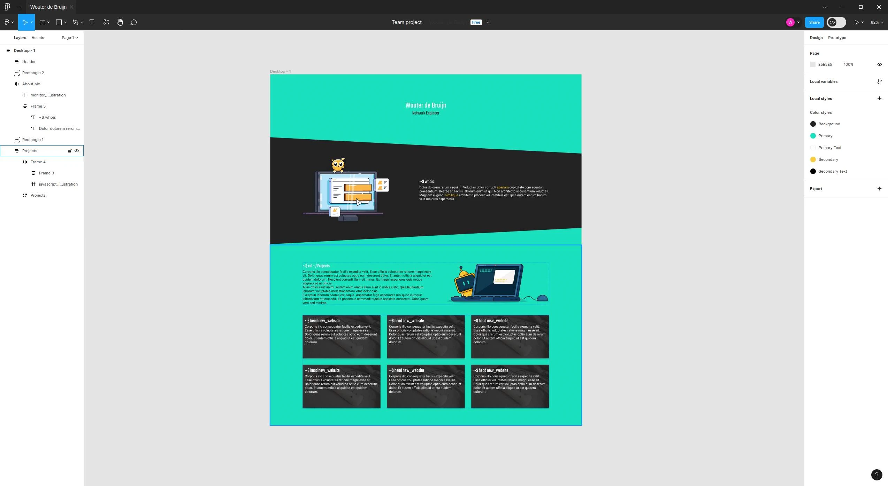

# New Website

Hey There! Welcome to my brand new website! As you can see, the site has changes
substantially, I am using a brand new tech-stack, design and general approach
for writing project details or blog posts. In this post I will be going over
these different changes and why I made them.

## Tech Stack

The previous site was build in plain [HTML](), [CSS]() and [JavaScript](), with
the addition of [Bootstrap]() and [jQuery]() for styling and functionality. I
build that website back in January 2020, I didn't have much web development
experience at the time. But I was keen to learn and build something. I guess
some things never change ;).

This website is build using [Deno](), [Fresh]() and [TailwindCSS](), I am quite
interested in the development of Deno and their web framework Fresh, although I
don't think it is suitable for big production projects. Smaller websites or
services like this portfolio or my [Emby Recap]() project fit well in the design
of the product. The setup is quick and minimalistic and development is fast,
both in development speed and actual needed compute power. However, the support
of (third party) components and utilities is extremely limited in comparison
with a well established framework like [React]() or even [Vue](). Component
libraries or even a different CSS engine then [TailWindCSS]() isn't current
available to my knowledge. Kind of like the early Deno days, if you need
something you have to publish a package yourself.

## Design

We have a brand new design! Finally, no more Bootstrap, endless scrolling to
read projects and limited project customization due to the fact that everything
was displayed on the home page. This new design brings a lot of changes, most of
the styling uses [TailWindCSS](), but the project pages use a customized version
of Github's [Primer]() styling. This is mostly because of some technical
reasons. But I while developing the website I started to like the readability
and simplicity of the Primer styling.

Unlike the previous website, I actually designed (part) of the website before
coding it. I used [Figma]() to design the home page, I didn't end up designing
the project pages, but I copied some elements of the homepage all headers,
paragraphs, images, etc are primary using Primer styling. The illustrations seen
on the home page of the website are made by
[Lukasz Adam](https://lukaszadam.com/illustrations), who provides free
illustrations for personal and commercial use. I am by no means a designer,
especially not for illustrations, so I am very happy that was able to use these
illustrations.

<!-- Figma design image -->

## Purpose

As you can see, the website has changed a lot. But why did I change it? Well, as
mentioned in previous "legacy" posts, changing the design and used technology of
the website has been on my mind since July 2021, I wanted to use some new
technologies that I actually use in my day to day life. In April of 2022 I also
came to realize that I wanted to be able to write longer, more detailed
projects. Something that the previous website was never meant to do.

This website, like the one before, is a fun exercise for me. Not necessarily
from a technical standpoint, but more from a writing standpoint. As you might
know I primarily speak Dutch, so writing down my projects in English is a fun
and meaningful way for me to develop my English writing skills. In addition to
that, I have discovered that having a history of my project is fun to look back
on. And it is a great way to show my skills to others.

## Conclusion

The website has changed a lot, and it is bound to change some more. I still have
to add a section showing my experience and skills, but I am not sure how I want
to do that yet. I am excited to see how this website will develop over time.

# Legacy Posts

Well, here we are, with a dilemma. I have a bunch of old project posts from the
old website. Which don't fit into the new design at all. But of course I don't
want to delete them. i have created a special project post for these legacy
posts. You can find them [here](/projects/legacy-posts).
