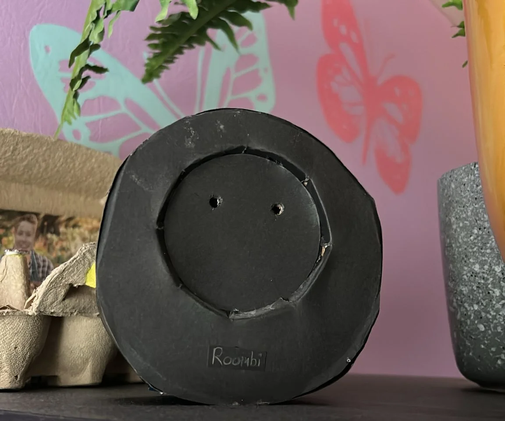
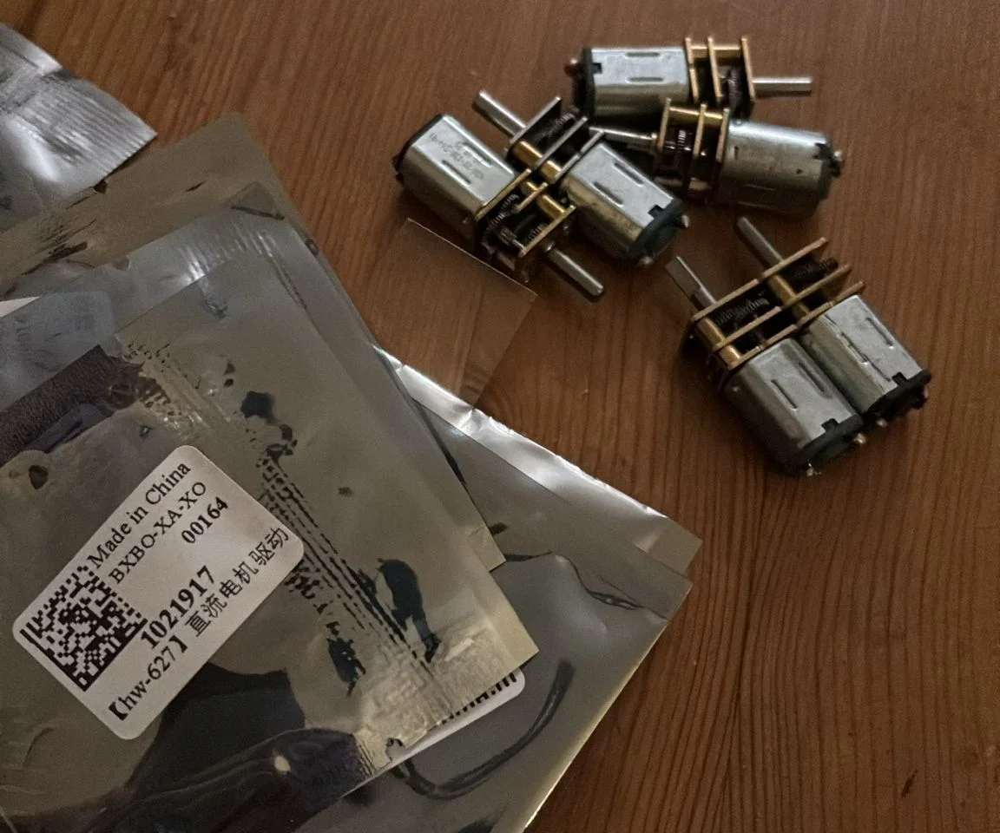

# Why?

So, you might know that robotic vacuum cleaners are awesome, they run around
cleaning your house. But of course, they can't get to all the places. For some
people this is a reason not to get a robot vacuum, which I think is invalid.
Even though it doesn't get everywhere, it can still do something, and it's a
robot that cleans for you! Who cares if it is not efficient.

Anyhow, there is one place that does bother me. Because I love these things, I
want to take good care of it. But the top of the robot vacuum gets dirty. And of
course, I can dust that off myself. But then I am just a servant to my machine.
That didn't sit right with me.

This was a bit of a joke between me and two of my friends, Ianthe and Sjors.

# Version 1

I made the first version of the mini roomba back in 2022 for Ianthe's birthday.
She is a great friend of mine that, at the time, was still completing her
studies as an industrial designer. This mini roomba did exactly nothing a
regular roomba does. It didn't vacuum, mop, clean in any meaningful way, or even
just drive around. It was made from cardboard and didn't have any motors or
cleaning brushes.

But what it did have was emotion, it had two eyes with an eyelash mechanism
behind it, behind that were two LEDs. It was more of a tamagotchi, there were a
couple of buttons on the side that gave it food, making it happy. If you didn't
interact with it for a little while, it would get sad or angry. The eyelashes
move up or down changing the size and form of the eyes, indicating its emotion.

As I mentioned, this one was made from cardboard. The eyelash mechanism was made
from cardstock with splitpins used to make the hingepoints, there was an Arduino
Pro Micro controlling a servo, two leds and listening for user input from the
buttons. Looking back, it was quite crude and simple, but it was a great project
and made for a nice personal gift.

# Version 2

At the end of 2024, Ianthe sent me a picture of Sjors's roomba, asking if we
could make a mini roomba for his birthday coming up in March. I replied saying
"Yes, that's gonna take some crafty work and effort, but I love the idea!"

## The plan

We didn't have much of a plan yet, but I started off ordering some small motors
and motor drivers. I bought some DRV8833 motor drivers, together with some small
geared motors with a speed of 40 RPM. I didn't do any calculations at the time,
but I just guessed that I didn't want to drive too fast, and the motors were
quite cheap, so buying some other ones later wouldn't be a problem if the speed
wasn't right.

I started testing some of the electronics, while Ianthe started thinking about
the design of the Roomba. Instead of cardboard, this one was going to be 3D
printed. So we started working together on a CAD model, with Ianthe's actual
degree in industrial design, and my hobbyist approach to anything 3D printing
related, we had an absolute blast designing the thing.

<Section>

<Video src="motor-test-web" />
</Section>

## Designing and testing the first elements

One of the elements I focused on were the new and improved eye lashes, as I
created these before in the cardboard version. The idea was quite similar, but
this time it would be 3D printed. So I had to design it in CAD. At this point I
had designed quite a lot of static parts before, but I never modeled these parts
into an assembly testing out movement or rotation. As I wasn't about to do any
calculations figuring out the correct angles or lengths to use. I started
learning to use my parts in assemblies and adding joints to them to make them
behave how I envisioned. This worked quite well, and after some tweaking, I had
the basic eye design figured out, apart from the location of the servo that was
going to actually move the parts.

<MediaStack>
<Video src="eyelashes-design-web" />
<Video src="motor-test-web" />
</MediaStack>

## Designing the body

While I worked on the eye design, Ianthe continued on the design of the overall
body and internals. We decided on the position of the motors and brushes, where
we needed to make sure that the cliff sensor positions would be forward enough
to register before driving off, as well as keeping them away from the spinning
brushes. For this, we ended up placing two sets of cliff sensors. Two at the
front, and two just before the rear wheels, as the rear wheels are spaced out
wider than the sensors, and could otherwise still fall off a table when the
robot turns. We also modeled in a small ledge on the inside, onto which we could
place an internal plate to mount some more electronics. For the final design we
modeled the body in CAD, we used OnShape for this, as I have experience in that
software. Some of the first designs and ideas were first drawn out on paper,
mostly by Ianthe, as I can't draw that well.

<MediaStack>
<Image src="roombie-design-1.webp" />
<Image src="roombie-design-2.webp" />
<Image src="roombie-design-3.webp" />
<Image src="roombie-design-4.webp" />
</MediaStack>

We started printing the base of the roomba, mostly to test fitment of the
motors, cliff sensors and for me to start writing the first bit of software. I
have quite a bit of experience in C and C++, but have never made a robot from
scratch like we were doing now. However, using this kind of sensors and motors
was actually quite similar to some assignment on my Network and System
engineering HBO study. This gave me a pretty good idea for how I wanted to
program the different elements and bring them together to make the roomba drive
around on its own. After some work on the electronics and software, the roomba
was able to drive around in a straight line, started and stopped using an HTTP
connection. I was quite excited and sent Ianthe a video of its first little
steps.

<Video src="roombie-driving-1-web" />

## Writing the software

I knew the roomba wasn't going to be the brightest, I wasn't about to write a
full algorithm to make it map the surface and clean it well. Because of this, I
started thinking about the other options. It needed to look cool, not fall off
the surface and sort of clean it. And I thought about the old DVD logo standby
screen, with it taking a turn every time it hit a corner, covering quite some
surface area of the screen. This would be quite simple to program and make the
roomba drive around quite well. I wouldn't need to map anything at all, the only
requirement would be that the cliff sensors would need to detect the edge and,
when they found one, the roomba would make a turn.

Immediately I ran into a big issue, I was using a
[Wemos D1 Mini](https://www.wemos.cc/en/latest/d1/d1_mini.html), which only has
one analog input. I would need 4, one for each cliff sensor. So I switched to a
[Arduino Pro Micro](https://docs.arduino.cc/hardware/micro/) with a ATmega32U4,
my version has a type-c port and provides 4 analog inputs. After a bit of work,
testing, troubleshooting and fixing I had the cliff sensors working reliably
making the roomba turn when it approached a cliff. There were still some edge
cases that were not covered. As the robot has 4 cliff sensors, 2 at the front
which should detect the cliff most of the time. But also two at the side, for
when a cliff is approached at a very shallow angle. Where otherwise one of the
wheels could fall off before making the turn. The turning behavior for those
scenarios would be different, as the back sensors are fairly close to the wheels
giving it no room to turn.

<Video src="roombie-driving-2-web" />

With the first steps of driving covered, I started testing some of the other
features we wanted, first the brushes. These also used some mini geared motors
and were driven with the same kind of motor driver as the drive motors. These
were wired up differently to the drive motors as they would only need to be
turned on and off as a group. No need for them to turn backwards or
individually, so the motor driver was a bit overkill, but I had it on hand. I
only wired up the enable pin of the DRV8833 to the Arduino.

<Video src="roombie-brush-test-web" />

After which it was time for the other big feature, the emotions. We worked on
the dome design and printed out a couple of tests, figuring out the mounting
system for the eye mechanism and placement for the eyes. We designed this in
multiple pieces for easier prototyping, as we wouldn't need to print the whole
dome each time. Only requiring smaller parts to be tweaked and printed. I
discovered that I needed a little bit more room in the dome for the servo to
move, for which I printed an extension ring for the dome to sit on. This ring
also had the mounting mechanism for the dome, for which we used a twist lock,
mounting the dome to the body. For testing I printed the ring out of white
filament. But when I showed Ianthe, we liked the contrast so much that we ended
up keeping it white, giving us the idea of adding panda ears to the top of the
dome to complete the look of the eyes.

<Video src="eyes-servo-mechanic-web" />

I was quite excited at this point, things were coming together nicely and it
started to look really cool. I love the moving eyes, I think it gives quite a
bit of emotion to the roomba. The plan was to mount two RGB LEDs behind the
eyelids, which would be able to change colors. For this, three PWM outputs were
needed to control the red, green and blue light channels. As well as a PWM
signal for the servo. However, I was running out of usable pins on my Arduino,
and I still wanted WiFi capability to provide some sort of interface. So, I
added the Wemos D1 mini to the dome of the Roomba, creating a serial bus between
the two microcontrollers. The emotions and webserver will be handled by the
Wemos, while the driving motors, brushes and cliff sensors were handled by the
Arduino.

<MediaStack>
<Image src="first-internals.webp" />
<Video src="eyes-test-web" />
</MediaStack>

The electronics were coming together quite nicely, which was quite important, as
the party for Sjors's birthday would be in about 24 hours. Now it was time for
final assembly, and making sure everything still worked as planned. We created
some small brushes, created out of a 3D printed center hub with brushes from a
paintbrush glued in. We went over a couple of iterations trying different ideas
to mount the brushes into the 3D print, but ended up on glue being the best
choice. I mounted in all the electronics and made the final solder connections.
Now around midnight the day before the party, I performed the test of the first
fully assembled version.

<MediaStack>
<Video src="brushes-test-web" />
<Video src="assembled-driving-test-web" />
</MediaStack>

# The day of the party

At its current state, Roombie was already quite cool. But he was still missing
some features. There was no web ui yet, HTTP connectivity was in place, but I
only used some GET and POST requests for debugging. There was no UI at all.
There was also no speaker yet, even though we planned for it in the design of
the dome, creating some holes in the back for a speaker to be mounted. I also
had some more ideas to give Roombie more character, making some noises when you
picked him up, occasionally making some noises when making turns, and anything
else I could come up with before the party.

As the party only started at 9PM, I started doing some more work. I mounted a
small speaker in the dome, which was connected to the Wemos D1, which provided a
PWM signal directly to the small PC speaker. It was only going to make simple
notes, no real audio files. I used the cliff sensors to determine if Roombie was
picked up. I also added some random noises and blinking of the eyes while
Roombie was driving around. I let some AI agent create a simple WebUI, this was
not going to be a key feature of the Roomba, and it would only provide some way
to start and stop it from driving around. I added a wireframe render of the
exploded view created in OnShape.

<MediaStack>
<Video src="roombie-pickup-web" controls muted={false} autoPlay={false} />
<Image src="roombie-web-ui.webp" />
<Image src="final-electronics-1.webp" />
<Image src="final-electronics-2.webp" />
<Image src="final-electronics-3.webp" />
</MediaStack>

## The party!

While I worked on the code and final assembly, Ianthe created a nice box for
Roombie to be gifted to Sjors. This was the final piece of the project making it
complete. It turned out awesome! I am really happy with the final result. Sjors
was quite surprised and loved it! The full source code of Roombie together with
the OnShape project can be found at my
[Github](https://github.com/wouterdebruijn/roombie/tree/main).

<MediaStack>
<Image src="roombie-present.webp" />
<Image src="IMG_6860.webp" />
<Image src="IMG_6862.webp" />
</MediaStack>
