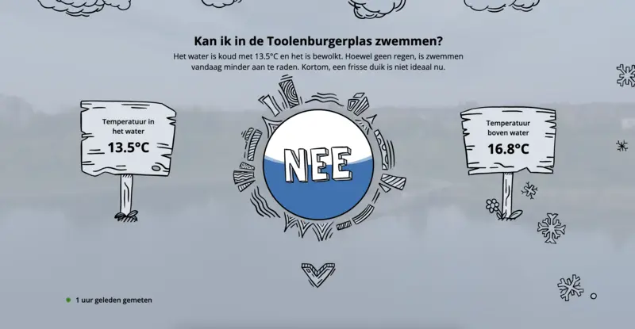

# Introduction

The Toolenburgerplas is a recreational lake in Hoofddorp, The Netherlands, known
for swimming, diving, and fishing. My friend
[Sjors van Holst](https://sjorsvanholst.nl) and I began regularly swimming in
the lake once a week for both exercise and relaxation. While the water was
pleasant in the summer, winter brought colder temperatures, and we eventually
turned to the local swimming pool. However, it wasn’t the same—the water was too
warm, and the pool was crowded. We decided to continue swimming in the lake
during the colder months by purchasing wetsuits, but even that solution had
limits as the water eventually became too cold. We paused swimming each winter,
waiting for the water to warm up in spring. This led to the recurring question:
"Can we swim in the Toolenburgerplas yet?"

# The Spark of an Idea

Wouldn’t it be useful to know the exact temperature of the lake year-round? This
simple idea led us to brainstorm a system that could monitor the lake's water
temperature remotely. If we could track the water temperature, we would know
precisely when it was warm enough to swim again. And why stop there? Making the
data accessible to others who enjoy the lake could benefit the broader
community. Our goal was to build a device that could measure the lake's water
temperature continuously and display the data online for anyone to access.

# Designing the Solution

We began exploring how we could implement this idea. The core requirements were:

- A reliable temperature sensor to measure the water temperature year-round.
- A microcontroller to process the sensor data.
- A data connection to send the information to a server where it could be stored
  and accessed.

The plan was to display the data on a website for easy access, showing both
current temperatures and trends over time.

# Version 1 - Building the Prototype

We chose the
[Arduino MKR NB 1500](https://docs.arduino.cc/hardware/mkr-nb-1500/) as the
microcontroller and purchased two temperature sensors—one for the water and one
for internal enclosure temperature monitoring. The device needed a waterproof
enclosure to protect the electronics while allowing part of it (e.g., the
antenna) to remain above water for connectivity.

## Power Source and Efficiency

To ensure the device could operate for extended periods, we used four 18650
batteries in parallel, charged by a wireless charging coil inside the enclosure.
To conserve power, we programmed the Arduino to "sleep" most of the time, only
waking up hourly to take measurements and send data. This approach worked well,
allowing the device to last over a month on a single charge.

## Software and Website

While I focused on the electronics and code, [Sjors](https://sjorsvanholst.nl)
developed the [website](https://toolenburgerplas.nl/) to display the temperature
data. The site, built using [Next.js](https://nextjs.org), is hosted on
[Vercel](https://vercel.com) and shows current water temperatures along with a
graph illustrating temperature trends over time. We stored the data on
[Supabase](https://supabase.io).

## API Challenges

We encountered challenges with API security because the Arduino had limited
support for SSL certificates. To solve this, I set up an Nginx reverse proxy on
a VPS to handle SSL termination, forwarding requests securely to the Supabase
API. Using Let's Encrypt, I ensured the certificates would renew automatically.
To optimize wake-up times, I removed unnecessary root certificates, leaving only
ISRG Root X1, which is valid until 2035—hopefully, the hardware lasts that long!

## Disaster Strikes!

We encountered a few issues during the project. The biggest concern was ensuring
the enclosure was watertight, but initial tests showed no signs of leaks.
However, after a month and a half of successful operation, the device stopped
sending data.

Upon inspection, we discovered that the antenna, placed outside the enclosure,
had corroded due to exposure to the elements. Initially, we suspected moisture
inside the enclosure, but after breaking the seal, we found that the interior
was completely dry. However, with the seal broken, the device could no longer be
submerged.

# Version 2 - The one that failed

We redesigned the enclosure to place the antenna in a sealed compartment,
keeping it protected from rainwater while maintaining connectivity. However,
this design had a different problem. The previous enclosure had to be broken
open, which meant that we had to create a new enclosure from scratch. Instead of
using a 3D printer, we decided to use a electrical junction box, which was
easier to work with. We sealed the electronics inside of a smaller 3D-printed
box, sourounded by epoxy resin. Which we hoped would keep the electronics dry.

Unfortunately, this version stopped working after a few weeks, we saw the
internal humidity sensor climbing to 100%, after which it wasn't able to read
the internal temperature and humidity anymore. The external temperature sensor
was still working, but only for a couple of days.

We left the device in the water for a few more weeks, but it never recovered.

# Version 3 - Our best idea yet

While we were ordering new parts for version 2, we stumbled upon a prebuilt
[LoRaWAN water temperature sensor](https://nl.aliexpress.com/item/1005005501508446.html?spm=a2g0o.order_list.order_list_main.5.387279d2aMLvX9&gatewayAdapt=glo2nld).
Complete with a splash-proof enclosure, and all the required electronics. We
decided to order one to see if it would work for our use case.

Originally we wanted most of the device to be submerged, with only the antenna
exposed. This would make the device less visible, and less likely to be tampered
with. But, this prebuilt device would be much easier to replace, and was less
expensive then the previous two versions. We decided to give it a try.

The previous versions had a cellular connection, which was used to make a HTTP
request to our website. This new device used LoRaWAN, which meant we had to
change our backend to support this new protocol. We decided to use
[The Things Network](https://www.thethingsnetwork.org/) as our backend, which
would receive the data from the device, and forward it to our website. The
website endpoint was changed to be compatible with the new data format.

We installed the new v3 buoy in the Toolenburgerplas, but we had some issues, it
seemed there was no coverage at the location where we placed the buoy. So we
looked into adding a LoRaWAN gateway near the lake, to ensure we had coverage.

I found a
[Dragino LG308](https://www.dragino.com/products/lora-lorawan-gateway/item/140-lg308.html)
gateway on Marktplaats for a good price, and we decided to buy it. We did some
tests placing the gateway at various locations around the lake, but
unfortunately we were not able to permanently place the gateway close enough for
the buoy to have coverage. The range of the gateway was a lot less then we had
hoped.

Then we remembered there were more LoRaWAN networks available,
[KPN](https://www.kpn.com/zakelijk/internet-of-things.htm), a Dutch telecom
provider, offers a commercial grade LoRaWAN network. We started looking into
registering our device on their network, which was way simpler then we initially
thought. They overed a Freemium tier, with a limit of 3 LoRa devices, which was
perfect for our use case.

We registered our device on the KPN network, and after a while we received data
in the KPN Things Portal. In order to forward this data to our website, we
needed to change the API endpoint to work with the new data format.

After which we were able to see the LoRaWAN data in our website! IT WORKED!

The website is now live at [toolenburgerplas.nl](https://toolenburgerplas.nl/),
the LoRaWAN coverage is not perfect, but most of the time we are able to receive
data, which is send every 25 minutes.
